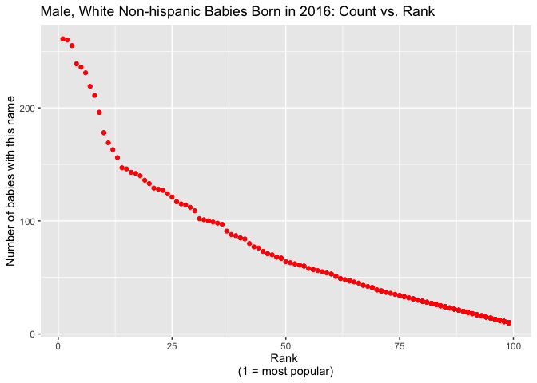

p8105\_hw2\_dz2426
================
Duzhi Zhao
9/24/2019

## Problem 1

# Section 1.1 Clean dataset “Mr.Trash Wheel”

``` r
# Load in Mr.Trash Wheel dataset
MTW_data = read_excel("./data/Trash-Wheel-Collection-Totals-8-6-19.xlsx", sheet = 1) %>%
  janitor::clean_names() %>% 
  drop_na(dumpster) %>%  #remove NA 
  select(-x15) %>%     #remove the last column with notes
  mutate(
    sports_balls = round(sports_balls, digits = 0) %>% #round to nearest integer
      as.integer()    #change type from double to integer
  )
```

# Section 1.2 Clean datasets “2017 & 2018 Precipitation”

``` r
# Load in and clean Precipitation 2017 dataset
Precip_2017 = read_excel("./data/Trash-Wheel-Collection-Totals-8-6-19.xlsx", sheet = 6, skip = 1) %>% 
  janitor::clean_names() %>% 
  drop_na(month) %>% 
  mutate(
    year = 2017       #add variabel year
  )

# Load in and clean Precipitation 2018 dataset
Precip_2018 = read_excel("./data/Trash-Wheel-Collection-Totals-8-6-19.xlsx", sheet = 5, skip = 1) %>% 
  janitor::clean_names() %>% 
  drop_na(total, month) %>%
  mutate(
    year = 2018         
  )

# Combine two datasets
Combine_ds = 
  bind_rows(Precip_2017, Precip_2018) %>% 
  janitor::clean_names() %>% 
  arrange(month) %>%   #list data in the order of month
  rename(total_in = total) %>%   #include units ("inches") for total precipitation
  mutate(
    month = as.character(month.abb[month])  #change month to character and correspond each number to its abbreviation
  )
```

Comment 1:

The resulting Mr.Trash Wheel dataset (MTW\_data) contains 344
observations and 16 variables. Variables include “dumpster” (dumpster
number), “month” and “year”(date of collection), “weight\_tons” (amount
of total litter), and categories of the items (e.g. “sports\_balls” and
“plastic\_bottles”).

The combined precipitation data (Combine\_ds) contains 24 observations
and 3 variables, including “month”, “total\_in” (total precipitation in
inches), and “year” (year of precipitation).

The total precipitation in 2018 was 70.33 inches. <br /> The median
number of sports balls in a dumpster in 2017 was 8.

## Problem 2

# Section 2.1 Clean dataset “pols\_month.csv”

``` r
# Load in pols_month.csv
pols_data = read_csv("./data/pols-month.csv") %>% 
  janitor::clean_names() %>% 
  separate(col = mon, into = c("year", "month", "day")) %>% 
  mutate(
    month = as.double(month),
    month = as.character(month.abb[month]), #change to month_name
    prez_gop = replace(prez_gop, prez_gop == 2, 1), 
    #recode prez_grop data entry as "1" from 1974/08/15 to 1974/12/15
    president = ifelse(prez_gop == TRUE, "republican", "democratic")
  ) %>% #use logical statement to combine "rep" and "dem"
  select(-c(day, prez_gop, prez_dem)) #drop three volumns
```

# Section 2.2 Clean dataset “snp.csv”

``` r
snp_data = read_csv("./data/snp.csv") %>% 
  janitor::clean_names() %>% 
  separate(col = date, into = c("month", "day", "year")) %>% 
  select(-day) %>% 
  mutate(
    month = as.double(month),
    month = as.character(month.abb[month]) #change to month name
  ) %>% 
  select(year, month, close) %>% #put year and month as leading columns
  arrange(year, month) #arrange in ascending order
```

# Section 2.3 Clean dataset “unemployment.csv”

``` r
unemp_data = read_csv("./data/unemployment.csv") %>% 
  janitor::clean_names() %>% 
  pivot_longer(
    jan:dec,
    names_to = "month",
    values_to = "percent_unemployment"
  ) #wide to long
```

# Section 2.4 Merge three datasets

``` r
# Merge snp.csv and pols_data first
first_merged = 
  full_join(pols_data, snp_data, by = c("year", "month")) %>% 
  #fully combine data by year and month
  janitor::clean_names() %>% 
  mutate(
    year = as.numeric(year), 
    #Change to the same variable type for combining with unemp_data
    month = str_to_lower(month)
    #ensure same format as in unemp_data
  )

# Merge the unemp_data into the above dataset 
final_merged = 
  full_join(first_merged, unemp_data, by = c("year", "month")) %>% 
  janitor::clean_names()
```

Comment 2:

“pols\_data” dataset contains 822 observations and 9 variables, showing
the distribution of the number of national politicians who are either
democratic or republican from Jan 1947 to Jun 2015. Key variables
include “year”, “month”, “president” (showing if the president is
republican or democratic).

“snp\_data” dataset contains 787 observations and 3 variables, showing
the Standard & Poor stocket market index (S\&P) from Apr 1950 to May
2015. Variables include “year”, “month”, and “close” (the closing values
of the S\&P stock index on the associated date).

“unemp\_data” dataset contains 816 observations and 3 variables, showing
the percentage of unemployment in each month of the associated year
ranged from Jan 1948 to Dec 2015. Variables include “year”, “month”, and
“percentage\_unemployment” (unemployment rate).

“final\_merged” dataset contains 828 observations and 11 variables,
combining the data from all three datasets above. It adds the
“percentage\_unemployment” and “close” variable into “pols\_data”
dataset, clearly displaying the trend of unemployment rate and the
closing values of the S\&P stock index with respect to each president’s
parties over time.

## Problem 3

# Section 3.1 Clean dataset “Popular\_Baby\_Names.csv”

``` r
names_data = 
  read_csv("./data/Popular_Baby_Names.csv") %>% 
  janitor::clean_names() %>% 
  mutate(
    childs_first_name = str_to_upper(childs_first_name),
    # change all names into uppercases
    ethnicity = recode(ethnicity, "ASIAN AND PACI" = "ASIAN AND PACIFIC ISLANDER"),
    ethnicity = recode(ethnicity, "WHITE NON HISP" = "WHITE NON HISPANIC"),
    ethnicity = recode(ethnicity, "BLACK NON HISP" = "BLACK NON HISPANIC")
    # rename to category names
  ) %>% 
  distinct() #remove duplicate rows
```

# Section 3.2 Table for popularity of the name “Olivia” over time

``` r
# Filter out the baby name "OLIVIA"
olivia_df = filter(names_data, childs_first_name == "OLIVIA", gender == "FEMALE")

# Create a table with necessary varibles
olivia_result = tibble(
  ethnicities = c(pull(olivia_df, ethnicity)),
  year = c(pull(olivia_df, year_of_birth)),
  rank = c(pull(olivia_df, rank))
)

# Long-to-wide
olivia_table = 
  pivot_wider(
    olivia_result,
    names_from = year,
    values_from = rank
  )
```

# Section 3.3 Table for most popular male baby names

``` r
# Filter out the male baby names with 1st rank"
male_df = filter(names_data, rank == 1, gender == "MALE")

# Create a table with necessary varibles
male_result = tibble(
  year = c(pull(male_df, year_of_birth)),
  names = c(pull(male_df, childs_first_name)),
  ethnicities = c(pull(male_df, ethnicity))
)

# Long-to-wide
male_table = 
  pivot_wider(
    male_result,
    names_from = year,
    values_from = names
  )
```

# Section 3.4 Table and graph for male, white non-hispanic children born in 2016

``` r
final_df = filter(names_data, gender == "MALE", ethnicity == "WHITE NON HISPANIC", year_of_birth == "2016")

scatterplot = 
  ggplot(final_df, aes(x = rank, y = count)) + 
  geom_point(color = 'red') +
  xlab("Rank \n(1 = most popular)") + 
  ylab("Number of babies with this name")

print(scatterplot + ggtitle("Male, White Non-hispanic Babies Born in 2016: Count vs. Rank"))
```

<!-- -->
